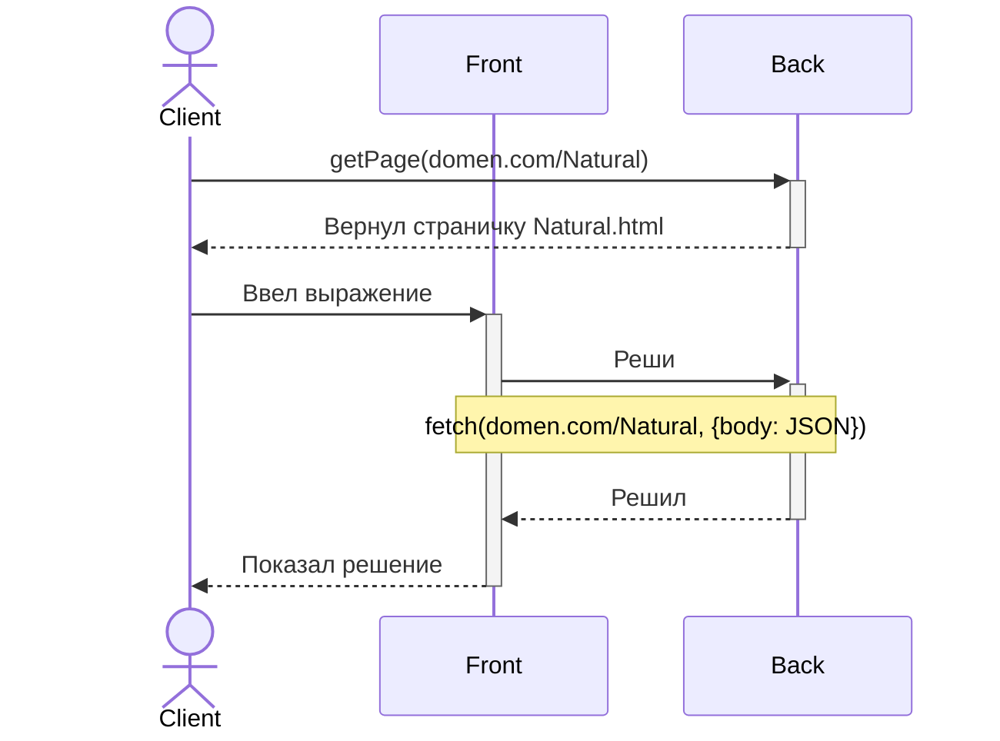

# Связи между фронтом и бэком



```json
 "32424" // Это натуральное число,
```

```json
 "-32424" // Это целое число

 "432" // ? Это тоже целое? 
```

```json
// Это рациональное
{
  "numerator": "123432",
  "denominator": "2342"
}
```

```json
// Это многочлен 15/8 + 7/19 * x + 5/8 * x²
[
  {"numerator": "15", "denominator": "8"},
  {"numerator": "7", "denominator": "19"},
  {"numerator": "5", "denominator": "8"}
]
```

```json
{
  "natural_operation": {
    "first_arg": "123432",
    "second_arg": "436"
  }
}
```

```json
{
  "integer_operation": {
    "first_arg": "123432",
    "second_arg": "-436"
  }
}
```

```json
{
  "rational_operation": {
    "first_arg": {
      "numerator": "123432",
      "denominator": "2342"
    },
    "second_arg": {
      "numerator": "123432",
      "denominator": "2342"
    }
  }
}
```

```json
{
  "polynom_operation": {
    "first_arg": [
      {"numerator": "123432", "denominator": "2342"},
      {"numerator": "14", "denominator": "13"}
    ],
    "second_arg": [
      {"numerator": "15", "denominator": "8"},
      {"numerator":  "7", "denominator":  "19"}
    ]
  }
}
```